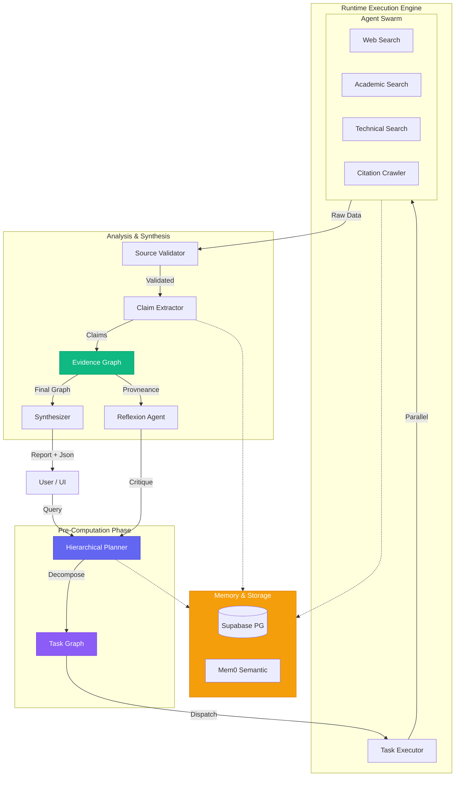

<div align="center">

# Deep Research Agent

### Autonomous, Hierarchical Research System with Verifiable Provenance

[](https://kestra.io)
[](https://supabase.com)
[](https://mem0.ai)
[](https://deepmind.google/technologies/gemini/)
[](https://python.org)
[](LICENSE)
[](https://hackathon.dev)

</div>

---

## Demo Video: 

Click the image above to watch the demo video

[](https://youtu.be/ABoEuW0wUTQ)

---

## The Problem
In an era of information overload, finding high-quality, verified answers to complex questions is difficult. Simple RAG (Retrieval-Augmented Generation) systems often fail on multi-step reasoning tasks and suffer from:
1.  **Hallucination**: Inventing facts when sources are missing.
2.  **Shallow Analysis**: Failing to connect dots across disparate sources.
3.  **Lack of Provenance**: Giving answers without traceable evidence.

## The Solution: Deep Research 
The **Deep Research Agent** is an autonomous system designed to emulate a human researcher. It doesn't just search; it **plans, investigates, validates, and synthesizes**.

### Core Methodology
1.  **Hierarchical Planning**: Instead of a linear chain of thought, the agent builds a dynamic **Task Graph**. It breaks complex goals into sub-tasks (research, validation, extraction) and executes them in parallel.
2.  **Evidence-First**: Every claim in the final report is backed by an **Evidence Graph**. This graph links specific text snippets from sources to the claims they support (or contradict).
3.  **Self-Correction**: A **Reflexion Loop** monitors progress. If the gathered information is insufficient or contradictory, the agent dynamically **re-plans**, adding new tasks to fill gaps.

---

## Key Features

- **Hierarchical Task Graph** - Dynamic planning with dependency management and parallel execution.
- **Evidence Graph** - Traceable claim provenance linking every sentence to its source.
- **Persistent Memory** - Long-term storage using Supabase (pgvector) and semantic recall via Mem0.
- **Source Validation** - "LLM-as-a-Judge" evaluates credibility, domain authority, and bias.
- **Reflexion & Re-planning** - Autonomous quality control that modifies the plan at runtime.
- **Multi-Hop Retrieval** - Recursively follows citations to find primary sources.
- **Adaptive Model Routing** - Routes simple tasks to faster models and complex reasoning to stronger models.

---

## Architecture



---

## Project Structure

```
Deep-Research-Agent/
├── src/
│   ├── planning/            # Task Graph & Execution Engine
│   │   ├── hierarchical_planner.py
│   │   ├── task_graph.py
│   │   └── executor.py
│   ├── evidence/            # Evidence Graph Logic
│   │   └── graph.py
│   ├── memory/              # Persistence Layer
│   │   ├── memory_api.py
│   │   └── supabase_store.py
│   ├── agents/              # Specialized Agents
│   │   ├── master_planner.py
│   │   ├── source_validator.py
│   │   ├── claiming_extractor.py
│   │   └── ...
│   └── core/                # Core Infrastructure
│       └── llm_client.py    # Adaptive Model Router
├── prompts/                 # System Prompts (.md)
├── kestra/                  # Orchestration Workflows
├── main.py                  # V2 Orchestrator Entrypoint
└── server.py                # REST API Server
```

---

## Quick Start

### Prerequisites
- Python 3.11+
- [Supabase](https://supabase.com) Account (for memory)
- API Keys: Google Gemini (recommended), or Together AI / OpenRouter

### Installation

1. **Clone the repository**
   ```bash
   git clone https://github.com/yourusername/Deep-Research-Agent.git
   cd Deep-Research-Agent
   ```

2. **Install dependencies**
   ```bash
   pip install -r requirements.txt
   ```

3. **Configure Environment**
   ```bash
   cp .env.example .env
   ```
   Edit `.env` with your keys:
   ```ini
   GEMINI_API_KEY=your_key_here
   SUPABASE_URL=your_url
   SUPABASE_KEY=your_key
   ```

### Running the Agent

**Option 1: CLI Mode**
```bash
python main.py
```
This runs a sample research query defined in `main.py`.

**Option 2: API Server**
```bash
python server.py
```
Starts a REST API at `http://localhost:8000`.

---

## Deployment

- **Backend**: Deploy as a Docker container on specialized GPU clouds or standard PaaS (Railway, Render).
- **Frontend**: Next.js application deployable on Vercel.
- **Database**: Managed Supabase instance.


