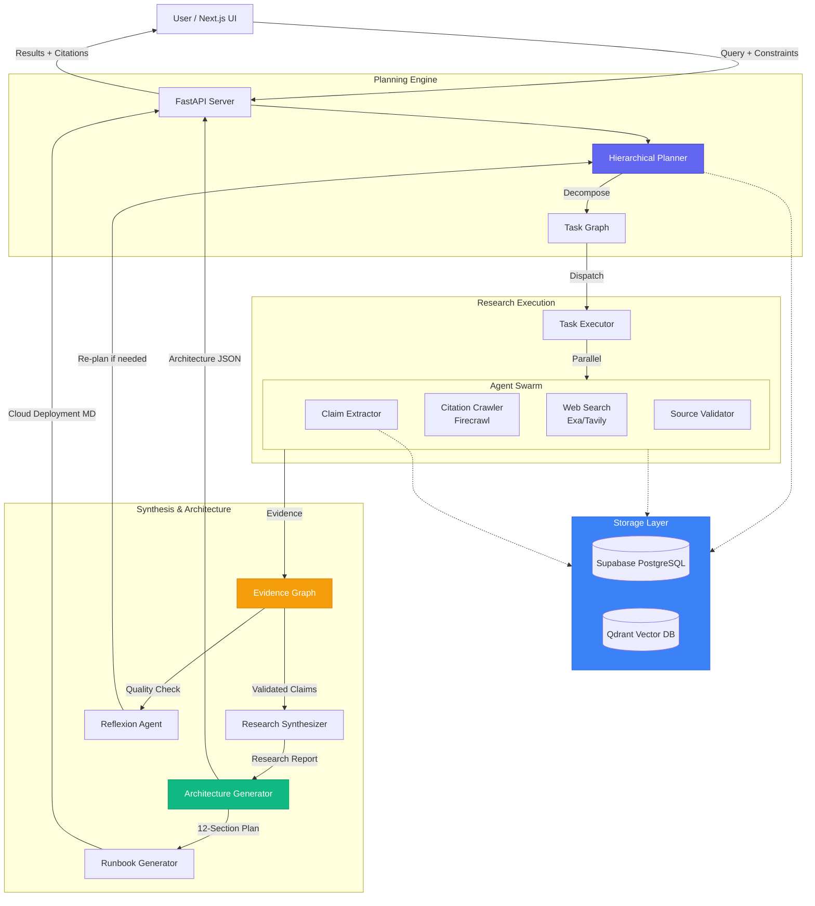

<div align="center">

# Deep Research Agent

### Autonomous, Hierarchical Research System with Production Architecture Generation

[](https://supabase.com)
[](https://qdrant.tech)
[](https://cerebras.ai)
[](https://nextjs.org)
[](https://python.org)
[](LICENSE)

</div>

---

## The Problem
Modern software development requires not just research, but actionable architecture recommendations. Traditional research tools and simple Q&A systems fail to:
1. **Generate Production-Ready Plans**: Moving from research to implementation requires architecture expertise
2. **Validate Complex Claims**: Multi-step reasoning across disparate sources is often shallow
3. **Provide Verifiable Provenance**: Answers lack traceable evidence and citations
4. **Consider Constraints**: Real-world requirements (scale, budget, compliance) are ignored

## The Solution: Deep Research with Architecture Generation
The **Deep Research Agent** is an autonomous system that goes beyond traditional research—it **plans, investigates, validates, synthesizes, and generates production-ready architectures**.

### Core Capabilities
1. **Hierarchical Planning**: Breaks complex research goals into dynamic task graphs with parallel execution
2. **Evidence-Based Research**: Every claim is backed by verified sources with full provenance tracking
3. **Production Architecture Generation**: Automatically generates constraint-aware, 12-section architecture plans including:
   - System diagrams (Mermaid)
   - Technology stack recommendations
   - Cost models and optimization strategies
   - Risk mitigation plans
   - Cloud-specific deployment runbooks (GCP/AWS/Azure)
4. **Self-Correction**: Reflexion loops monitor quality and dynamically re-plan when gaps are detected

---

## Key Features

- **🔬 Hierarchical Research** - Dynamic task graphs with dependency management and parallel execution
- **📊 Evidence Graph** - Traceable claim provenance linking every statement to source documents
- **🏗️ Architecture Generator** - Constraint-aware production architecture plans with cost/risk analysis
- **☁️ Cloud Deployment** - Platform-specific runbooks for GCP, AWS, and Azure
- **💾 Persistent Memory** - Session management with Supabase and semantic storage via Qdrant
- **✅ Source Validation** - LLM-based evaluation of credibility, domain authority, and bias
- **🔄 Reflexion & Re-planning** - Autonomous quality control with runtime plan modification
- **🔗 Multi-Hop Retrieval** - Recursive citation following to find primary sources
- **⚡ Adaptive Routing** - Fast models for simple tasks, powerful models for complex reasoning
- **🎨 Modern UI** - Next.js interface with WebGL backgrounds and real-time updates

---

## Architecture



---

## Project Structure

```
Deep-Research-Agent/
├── src/
│   ├── agents/                      # Specialized Agents
│   │   ├── master_planner.py
│   │   ├── hierarchical_planner.py
│   │   ├── claim_extractor.py
│   │   ├── source_validator.py
│   │   ├── web_search.py
│   │   └── reflexion.py
│   ├── architecture_generator.py    # Production Architecture Generator
│   ├── architecture_integration.py  # Architecture Service Layer
│   ├── planning/                    # Task Graph & Execution
│   │   ├── task_graph.py
│   │   └── executor.py
│   ├── evidence/                    # Evidence Graph Logic
│   │   └── graph.py
│   ├── memory/                      # Memory & Persistence
│   │   ├── memory_api.py
│   │   └── models.py
│   ├── storage/                     # Supabase Integration
│   │   └── supabase_store.py
│   ├── privacy/                     # PII Protection
│   │   └── pii_scrubber.py
│   ├── tools/                       # Search Tools (Exa, Tavily)
│   │   └── search_tools.py
│   └── core/                        # Core Infrastructure
│       ├── llm_client.py
│       └── context_manager.py
├── frontend/                        # Next.js 14 Application
│   ├── app/
│   │   ├── page.tsx                # Homepage
│   │   └── research/
│   │       └── page.tsx            # Research Interface
│   ├── components/
│   │   ├── architecture-plan.tsx   # Architecture Display
│   │   ├── research-plan.tsx       # Research Plan UI
│   │   ├── source-card.tsx
│   │   ├── markdown.tsx
│   │   └── ui/                     # shadcn/ui Components
│   └── public/
├── prompts/                         # System Prompts
│   ├── hierarchical_planner_prompt.md
│   ├── claim_extraction_prompt.md
│   ├── source_validator_prompt.txt
│   └── ...
├── supabase/                        # Database Migrations
│   └── migrations/
├── tests/                           # Test Suite
├── main.py                          # CLI Orchestrator
└── server.py                        # FastAPI Server
```

---

## Quick Start

### Prerequisites
- Python 3.11+
- Node.js 18+ (for frontend)
- [Supabase](https://supabase.com) Account (for session storage)
- [Qdrant Cloud](https://cloud.qdrant.io) Account (for semantic memory)
- API Keys:
  - [Cerebras](https://cerebras.ai) (for LLM inference)
  - [Exa](https://exa.ai) or [Tavily](https://tavily.com) (for web search)
  - [Firecrawl](https://firecrawl.dev) (for web scraping)

### Backend Setup

1. **Clone the repository**
   ```bash
   git clone https://github.com/Chirag-agg/Research_Agent.git
   cd Research_Agent
   ```

2. **Install Python dependencies**
   ```bash
   pip install -r requirements.txt
   ```

3. **Configure Environment**
   Create a `.env` file with your API keys:
   ```ini
   # LLM Configuration
   CEREBRAS_API_KEY=your_cerebras_key
   DEFAULT_MODEL=meta-llama/Llama-3.1-70B-Instruct-Turbo
   FAST_MODEL=meta-llama/Llama-3.1-8B-Instruct-Turbo

   # Search APIs
   EXA_API_KEY=your_exa_key
   TAVILY_API_KEY=your_tavily_key
   FIRECRAWL_API_KEY=your_firecrawl_key

   # Storage
   SUPABASE_URL=your_supabase_url
   SUPABASE_KEY=your_supabase_key

   # Vector DB
   QDRANT_URL=your_qdrant_cluster_url
   QDRANT_API_KEY=your_qdrant_api_key
   ```

4. **Set up Supabase**
   ```bash
   # Install Supabase CLI (if not already installed)
   scoop install supabase  # Windows
   # or brew install supabase/tap/supabase  # macOS

   # Link your project
   supabase link --project-ref your_project_ref

   # Push migrations
   supabase db push
   ```

### Frontend Setup

1. **Navigate to frontend directory**
   ```bash
   cd frontend
   ```

2. **Install dependencies**
   ```bash
   npm install
   # or pnpm install
   ```

3. **Start development server**
   ```bash
   npm run dev
   ```

### Running the Application

1. **Start the backend API**
   ```bash
   python server.py
   ```
   Server runs at `http://localhost:8000`

2. **Start the frontend** (in a separate terminal)
   ```bash
   cd frontend
   npm run dev
   ```
   UI available at `http://localhost:3000`

3. **Submit a research query**
   - Navigate to `http://localhost:3000/research`
   - Enter your research question
   - Configure architecture constraints (DAU, latency, budget, compliance)
   - Click "Start Research" and wait for results
   - Generate production architecture plan from the research findings

---

## API Endpoints

### Research
- `POST /api/research` - Submit a research query
- `GET /api/session/{session_id}` - Get session details
- `GET /api/history` - List research history

### Architecture Generation
- `POST /api/generate-architecture` - Generate production architecture plan
  ```json
  {
    "system_name": "E-commerce Platform",
    "recommended_solution": "Microservices with event-driven architecture...",
    "constraints": {
      "daily_active_users": 100000,
      "peak_rps": 500,
      "latency_target_ms": 200,
      "budget_min_monthly": 5000,
      "budget_max_monthly": 15000,
      "compliance": ["PCI-DSS", "SOC2"]
    }
  }
  ```

- `POST /api/generate-deployment-runbook` - Generate cloud-specific deployment guide
  - Supports GCP, AWS, and Azure
  - Returns markdown with step-by-step instructions

### Memory
- `POST /api/memory/add` - Store memory/context
- `POST /api/memory/search` - Semantic search across memories

---

## Architecture Generator Output

The system generates comprehensive 12-section architecture plans:

1. **Executive Summary** - High-level overview and recommendations
2. **System Diagram** - Mermaid architecture diagram
3. **Components** - Detailed component breakdown with responsibilities
4. **Technology Stack** - Concrete tooling recommendations with alternatives
5. **Deployment Architecture** - Multi-environment setup (dev/staging/prod)
6. **Scalability Strategy** - Horizontal/vertical scaling approaches
7. **Observability Plan** - Monitoring, logging, and tracing setup
8. **Security & Compliance** - Controls mapping and security measures
9. **Cost Model** - Detailed cost breakdown with optimization strategies
10. **Risk Mitigation** - Identified risks with probability, impact, and RTO
11. **Future Evolution** - Roadmap for scaling and feature expansion
12. **Metadata** - Constraints, timestamp, and version info

---

## Deployment

### Production Deployment

**Backend (FastAPI + Python)**
- Deploy on Railway, Render, or Fly.io
- Environment variables configured via platform dashboard
- Recommended: 2GB RAM, 1 vCPU minimum

**Frontend (Next.js)**
- Deploy on Vercel (recommended) or Netlify
- Automatic deployments from GitHub
- Environment variable: `NEXT_PUBLIC_API_URL`

**Database**
- Managed Supabase instance (included in free tier)
- Vector storage via Qdrant Cloud

### Docker Deployment
```bash
# Build and run with docker-compose
docker-compose up -d
```

---

## Technology Stack

- **Backend**: FastAPI, Python 3.11+
- **Frontend**: Next.js 14, React 18, TypeScript, Tailwind CSS
- **LLM**: Cerebras (Llama 3.1 70B/8B models)
- **Search**: Exa API, Tavily API
- **Web Scraping**: Firecrawl
- **Storage**: Supabase (PostgreSQL with pgvector)
- **Vector DB**: Qdrant Cloud
- **UI Components**: shadcn/ui, Radix UI
- **Animations**: OGL WebGL renderer

---


## Contributing

Contributions are welcome! Please feel free to submit a Pull Request.

1. Fork the repository
2. Create your feature branch (`git checkout -b feature/amazing-feature`)
3. Commit your changes (`git commit -m 'Add amazing feature'`)
4. Push to the branch (`git push origin feature/amazing-feature`)
5. Open a Pull Request

---

## License

This project is licensed under the Apache License 2.0 - see the [LICENSE](LICENSE) file for details.

---

## Acknowledgments

- Powered by [Cerebras](https://cerebras.ai) inference
- Search capabilities by [Exa](https://exa.ai) and [Tavily](https://tavily.com)
- Storage by [Supabase](https://supabase.com)
- Vector search by [Qdrant](https://qdrant.tech)

---

<div align="center">

**Built by [Chirag Aggarwal](https://github.com/Chirag-agg)**

</div>


