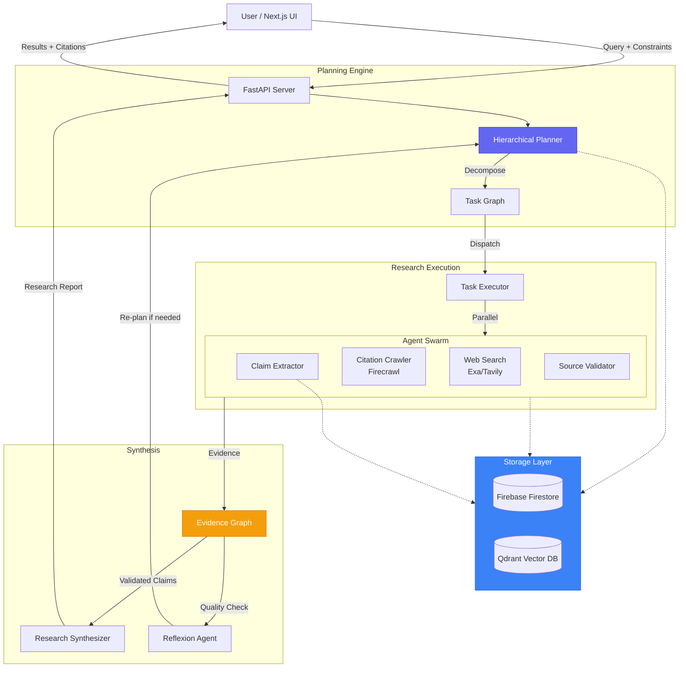

# Deep Research Agent

## Autonomous, Hierarchical Research System with Evidence Graphs

[](https://firebase.google.com)
[](https://qdrant.tech)
[](https://cerebras.ai)
[](https://nextjs.org)
[](https://python.org)

---

## The Problem

Modern software development requires not just research, but actionable architecture recommendations. Traditional research tools and simple Q&A systems fail to:

1. **Generate Production-Ready Plans**: Moving from research to implementation requires architecture expertise
2. **Validate Complex Claims**: Multi-step reasoning across disparate sources is often shallow
3. **Provide Verifiable Provenance**: Answers lack traceable evidence and citations
4. **Consider Constraints**: Real-world requirements (scale, budget, compliance) are ignored

## The Solution: Deep Research with Evidence Graphs

The Deep Research Agent goes beyond traditional research. It plans, investigates, validates, synthesizes, and produces traceable research reports.

## Core Capabilities

1. **Hierarchical Planning**: Breaks complex research goals into dynamic task graphs with parallel execution
2. **Evidence-Based Research**: Every claim is backed by verified sources with full provenance tracking
3. **Claim Extraction & Validation**: Extracts claims and validates source credibility and bias
4. **Self-Correction**: Reflexion loops monitor quality and dynamically re-plan when gaps are detected

---

## Key Features

- **Hierarchical Research** - Dynamic task graphs with dependency management and parallel execution
- **Evidence Graph** - Traceable claim provenance linking every statement to source documents
- **Claim-Centric Memory** - Evidence graph linking claims to sources with provenance
- **Persistent Memory** - Session management with Firebase Firestore and semantic storage via Qdrant
- **Source Validation** - LLM-based evaluation of credibility, domain authority, and bias
- **Reflexion and Re-planning** - Autonomous quality control with runtime plan modification
- **Multi-Hop Retrieval** - Recursive citation following to find primary sources
- **Adaptive Routing** - Fast models for simple tasks, powerful models for complex reasoning
- **Modern UI** - Next.js interface with WebGL backgrounds and real-time updates

---

## Architecture


```mermaid
flowchart TB
   User[User / Next.js UI] --> |"Query + Constraints"| API[FastAPI Server]

   subgraph Storage["Storage Layer"]
      Firestore[(Firebase Firestore)]
      Qdrant[(Qdrant Vector DB)]
   end

   subgraph Planning["Planning Engine"]
      API --> HPA[Hierarchical Planner]
      HPA --> |"Decompose"| TG[Task Graph]
   end

   subgraph Execution["Research Execution"]
      TG --> |"Dispatch"| Executor[Task Executor]
      Executor --> |"Parallel"| Agents
      subgraph Agents["Agent Swarm"]
         WSA[Web Search<br/>Exa/Tavily]
         CC[Citation Crawler<br/>Firecrawl]
         CE[Claim Extractor]
         Val[Source Validator]
      end
   end

   subgraph Analysis["Synthesis"]
      Agents --> |"Evidence"| EG[Evidence Graph]
      EG --> |"Validated Claims"| Syn[Research Synthesizer]
      Syn --> |"Research Report"| API
      EG --> |"Quality Check"| Ref[Reflexion Agent]
      Ref --> |"Re-plan if needed"| HPA
   end

   API --> |"Results + Citations"| User
   HPA & Agents & CE -.-> Storage

   style HPA fill:#6366f1,stroke:#4338ca,color:#fff
   style EG fill:#f59e0b,stroke:#d97706,color:#fff
   style Storage fill:#3b82f6,stroke:#2563eb,color:#fff
```

---

## Current Status

- Research orchestration, evidence graph, and claim validation are implemented and exposed via FastAPI.
- Persistence to Firebase Firestore is optional; if unset, the API runs with in-memory session tracking only.
- Architecture generation endpoints are available via the API and frontend.

---

## Project Structure

```text
Deep-Research-Agent/
├── src/
│   ├── agents/                      # Specialized Agents
│   │   ├── master_planner.py
│   │   ├── hierarchical_planner.py
│   │   ├── claim_extractor.py
│   │   ├── source_validator.py
│   │   ├── web_search.py
│   │   └── reflexion.py
│   ├── architecture_generator.py    # Production Architecture Generator
│   ├── architecture_integration.py  # Architecture Service Layer
│   ├── planning/                    # Task Graph and Execution
│   │   ├── task_graph.py
│   │   └── executor.py
│   ├── evidence/                    # Evidence Graph Logic
│   │   └── graph.py
│   ├── memory/                      # Memory and Persistence
│   │   ├── memory_api.py
│   │   └── models.py
│   ├── storage/                     # Firebase Firestore Integration
│   │   └── firestore_store.py
│   ├── privacy/                     # PII Protection
│   │   └── pii_scrubber.py
│   ├── tools/                       # Search Tools (Exa, Tavily)
│   │   └── search_tools.py
│   └── core/                        # Core Infrastructure
│       ├── llm_client.py
│       └── context_manager.py
├── frontend/                        # Next.js 14 Application
│   ├── app/
│   │   ├── page.tsx                # Homepage
│   │   └── research/
│   │       └── page.tsx            # Research Interface
│   ├── components/
│   │   ├── architecture-plan.tsx   # Architecture Display
│   │   ├── research-plan.tsx       # Research Plan UI
│   │   ├── source-card.tsx
│   │   ├── markdown.tsx
│   │   └── ui/                     # shadcn/ui Components
│   └── public/
├── prompts/                         # System Prompts
│   ├── hierarchical_planner_prompt.md
│   ├── claim_extraction_prompt.md
│   ├── source_validator_prompt.txt
│   └── ...
├── firebase_key.json                # Firebase Service Account Key
├── tests/                           # Test Suite
├── main.py                          # CLI Orchestrator
└── server.py                        # FastAPI Server
```

---

## Quick Start

### Prerequisites

- Python 3.11+
- Node.js 18+ (for frontend)
- Optional: [Firebase](https://firebase.google.com) (session persistence)
- Optional: [Qdrant](https://qdrant.tech) (vector memory, falls back to localhost)
- API Keys (at least one LLM provider and one search provider):
  - LLM: `GEMINI_API_KEY` or `OPENROUTER_API_KEY` or `TOGETHER_API_KEY` or `CEREBRAS_API_KEY`
  - Search: [Exa](https://exa.ai) (`EXA_API_KEY`) or [Tavily](https://tavily.com) (`TAVILY_API_KEY`)
  - Scraping: [Firecrawl](https://firecrawl.dev) (`FIRECRAWL_API_KEY`)

### Backend Setup

1. **Clone the repository**

   ```bash
   git clone https://github.com/Chirag-agg/Research_Agent.git
   cd Research_Agent
   ```

2. **Install Python dependencies**

   ```bash
   pip install -r requirements.txt
   ```

3. **Configure Environment**

   Create a `.env` file (only include what you use):

   ```ini
   # LLM (pick one provider)
   GEMINI_API_KEY=your_gemini_key
   # or OPENROUTER_API_KEY=your_openrouter_key
   # or TOGETHER_API_KEY=your_together_key
   # or CEREBRAS_API_KEY=your_cerebras_key
   # Optional overrides
   DEFAULT_MODEL=gemma-3-27b-it
   FAST_MODEL=gemma-3-27b-it

   # Search and scraping
   EXA_API_KEY=your_exa_key
   TAVILY_API_KEY=your_tavily_key
   FIRECRAWL_API_KEY=your_firecrawl_key

   # Storage (optional; leave unset to run without Firestore persistence)
   FIREBASE_CREDENTIALS_PATH=./firebase_key.json
   FIREBASE_AUTH_ENABLED=false

   # Vector DB (optional; defaults to local Qdrant if URL absent)
   QDRANT_URL=your_qdrant_url
   QDRANT_API_KEY=your_qdrant_api_key
   ```

4. **Set up Firebase (optional)**

   ```bash
   # 1. Go to Firebase Console → Project Settings → Service Accounts
   # 2. Generate a new private key and save as firebase_key.json in the project root
   # 3. Set the path in .env:
   FIREBASE_CREDENTIALS_PATH=./firebase_key.json
   ```

### Frontend Setup

1. **Navigate to frontend directory**

   ```bash
   cd frontend
   ```

2. **Install dependencies**

   ```bash
   npm install
   # or pnpm install
   ```

3. **Start development server**

   ```bash
   npm run dev
   ```

### Running the Application

1. **Start the backend API**

   ```bash
   python server.py
   ```

   Server runs at `http://localhost:8000`

2. **Start the frontend** (in a separate terminal)

   ```bash
   cd frontend
   npm run dev
   ```

   UI available at `http://localhost:3000`

3. **Submit a research query**

   - Navigate to `http://localhost:3000/research`
   - Enter your research question
   - Click "Start Research" and wait for results
   - Inspect claims, sources, and evidence graph in the UI

---

## API Endpoints (backend/server.py)

- `POST /api/research` - Start a research run (background task)
- `GET /api/research/{session_id}` - Check live status or result
- `GET /api/history` - List recent sessions (if Firestore configured)
- `GET /health` - Health check

---

## Deployment

### Production Deployment

#### Backend (FastAPI + Python)

- Deploy on Railway, Render, or Fly.io
- Environment variables configured via platform dashboard
- Recommended: 2GB RAM, 1 vCPU minimum

#### Frontend (Next.js)

- Deploy on Vercel (recommended) or Netlify
- Automatic deployments from GitHub
- Environment variable: `NEXT_PUBLIC_API_URL`

#### Database

- Managed Firebase Firestore instance (included in free tier)
- Vector storage via Qdrant Cloud

### Docker Deployment

```bash
# Build and run with docker-compose
docker-compose up -d
```

---

## Technology Stack

- **Backend**: FastAPI, Python 3.11+
- **Frontend**: Next.js 14, React 18, TypeScript, Tailwind CSS
- **LLM**: Gemini / OpenRouter / Together / Cerebras (select via env)
- **Search**: Exa API, Tavily API
- **Web Scraping**: Firecrawl
- **Storage**: Optional Firebase Firestore
- **Vector DB**: Qdrant (cloud or local)
- **UI Components**: shadcn/ui, Radix UI
- **Animations**: OGL WebGL renderer

---

## Contributing

Contributions are welcome! Please feel free to submit a Pull Request.

1. Fork the repository
2. Create your feature branch (`git checkout -b feature/amazing-feature`)
3. Commit your changes (`git commit -m 'Add amazing feature'`)
4. Push to the branch (`git push origin feature/amazing-feature`)
5. Open a Pull Request

---

## License

This project is licensed under the Apache License 2.0. See [LICENSE](LICENSE) for details.

---

## Acknowledgments

- Powered by [Cerebras](https://cerebras.ai) inference
- Search capabilities by [Exa](https://exa.ai) and [Tavily](https://tavily.com)
- Storage by [Firebase](https://firebase.google.com)
- Vector search by [Qdrant](https://qdrant.tech)

---

Built by [Chirag Aggarwal](https://github.com/Chirag-agg)
